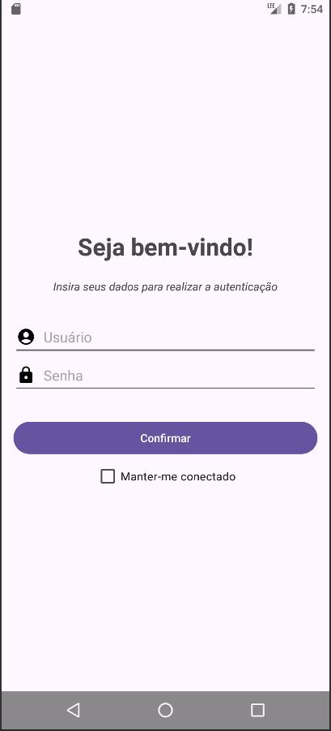

# Tela de login

### Fluxo da tela de login

O fluxo da tela de login consiste em fazer uma requisição via protocolo http, passando usuário e senha, autenticar o usuário e ir para a tela principal da aplicação.

### Casos de login

- **Conexão e autenticação confirmados:** Vai para a tela principal;
- **Conexão confirmada e autenticação não confirmada:** Recebe mensagem de alerta (1);
- **Conexão não confirmada:** Recebe mensagem de alerta (2).

*Observação:*

O check-box "Manter-me conectado" salva o usuário e a senha no sistema local, permitindo que a aplicação, ao ser inicializada, faça o login automaticamente.
