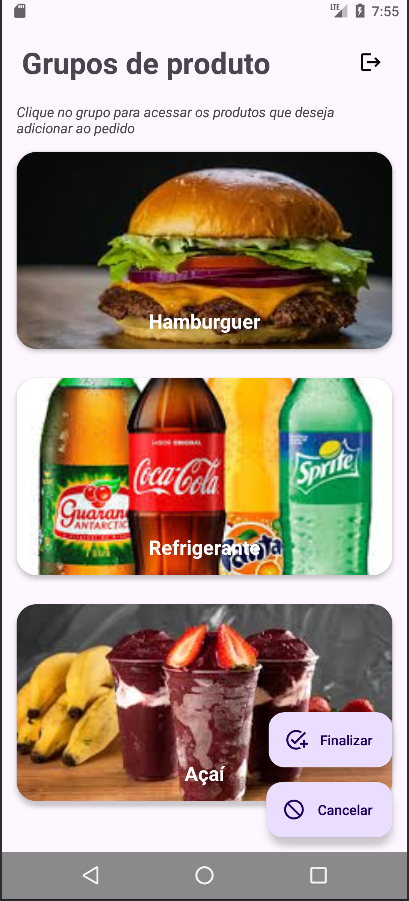

# Tela principal

### Fluxo da tela principal

O fluxo da tela de principal consiste em, ao ser inicializada, o sistema automaticamente faz uma requisição via protocolo http que recebe uma lista de grupos de produtos para ser exibida na tela. O objetivo é que o usuário tenha as opções de ir para a tela de produtos do grupo que deseja (abrindo uma segunda tela onde ele pode adicionar itens ao pedido), fazer logout e, ao retornar da segunda tela para a tela principal, o usuário pode finalizar ou cancelar o pedido. Caso o usuário finalize o pedido, o sistema faz outra requisição via protocolo http que envia o pedido.
