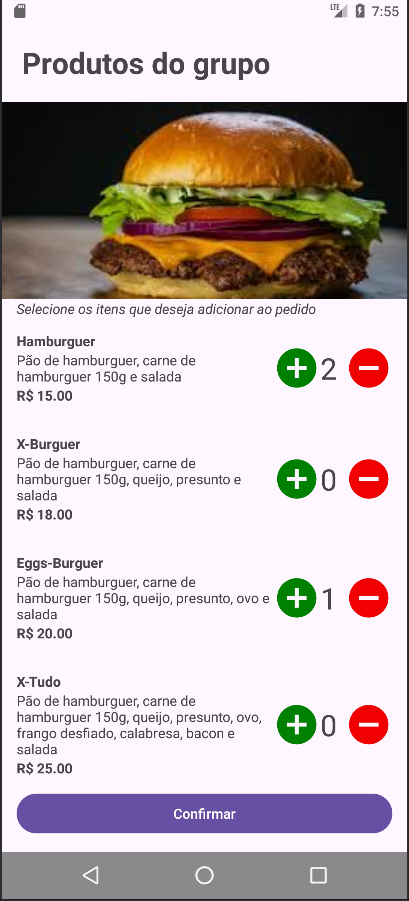
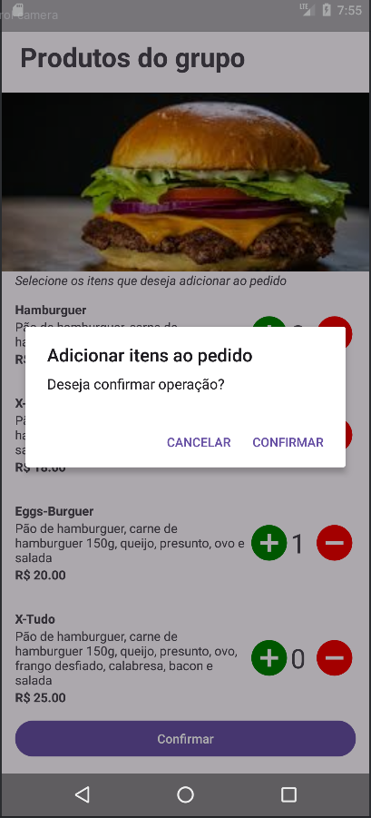

# Tela de produtos

### Fluxo da tela de produtos

O fluxo da tela de produtos consiste em, ao ser inicializada, o sistema automaticamente faz uma requisição via protocolo http, enviando o grupo do produto e recebendo uma lista que contém somente os produtos daquele grupo. Por fim, o sistema exibe a lista de produtos do grupo na tela. O objetivo é que o usuário tenha a opção de selecionar a quantidade cada produto que deseja adicionar ao pedido. Ao clicar no botão confirmar, o usuário adiciona os produtos a um pedido em memória e retorna para a tela principal.
